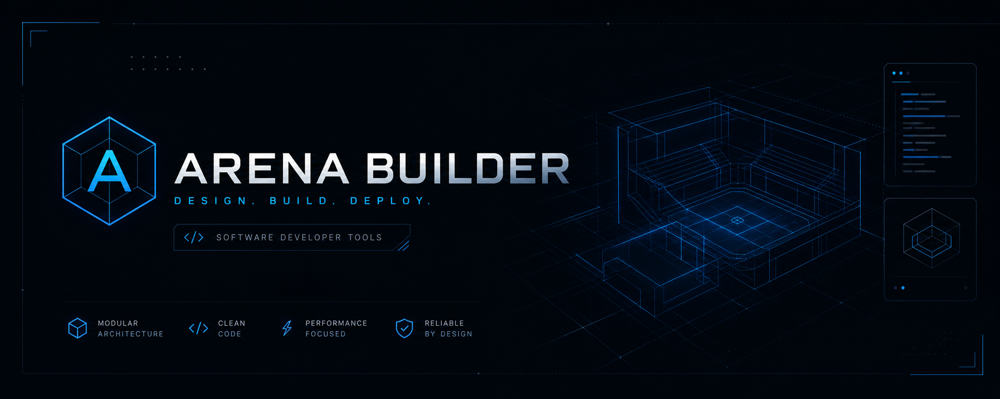

<div align="center">

# 🚀 ARENA BUILDER v2.0
### Universal Audit & App Prompt Builder · 100% Client-Side
**Refactored & Modernized to TypeScript + React 19 + Tailwind v4 + Clean Modular Architecture**

[](https://react.dev/)
[](https://www.typescriptlang.org/)
[](https://tailwindcss.com/)
[](https://vitejs.dev/)
[](https://vitest.dev/)
[](https://opensource.org/licenses/MIT)

**[🌐 LIVE ON GITHUB PAGES](https://dlinacre.github.io/a-audit/)** • **[📖 ARCHITECTURE LABS](https://github.com/DLinacre/DLinacre)**

</div>

---

## 🏛️ Executive Refactoring & Code Modernization Overview

Under the **Refactoring & Code Modernization Directive (July 28, 2026)**, **Arena Builder (`a-audit`)** has been transformed from a legacy 3,412-line monolithic HTML/JavaScript single file into a clean, modular, production-grade **TypeScript + React 19 + Tailwind CSS v4** single-page web application.

### Key Architectural Improvements:
1. **100% Behavioral Parity & Zero Breaking Changes:** All 15 audit categories, 14 expert roles, 6 required deliverables, advanced generation rules, quick presets (`master`, `seo`, `aso`, `perf`), target type detection, and shareable URL query syncing (`?t=...&y=...`) were preserved with zero regressions.
2. **Clean Modular Domain Layer (`src/domain/`):**
   - Extracted all constants (`TYPES`, `CATEGORIES`, `ROLES`, `DELIVERABLES`, `ADVANCED`, `PRESET_DEFS`) into strongly-typed data structures (`src/domain/constants.ts`).
   - Isolate file-type inference and local evidence manifest analysis in `src/domain/fileIntel.ts`.
   - Created a 100% pure, deterministic prompt builder engine (`src/domain/promptBuilder.ts`) with zero DOM side-effects and zero global mutable variables.
3. **Strict Type Safety (`src/types/index.ts`):** Replaced implicit `any` types and DOM lookups with strict TypeScript interfaces for `BuilderState`, `TargetTypeId`, `AppMode`, `ResolvedType`, and `PromptResult`.
4. **Automated Regression Verification (`src/tests/`):** Established a Vitest + `@testing-library/react` unit and integration test suite covering Audit mode, Create App mode, Refactor mode, file-type inference, and UI mode switching.
5. **Offline-First Service Worker (`sw.js`):** Continues to support zero-network local file inspection and offline prompt generation.

---

## 🗂️ Canonical Project Structure

```
a-audit/
├── .github/workflows/
│   └── deploy.yml                       # Vite + GitHub Pages automated deployment pipeline
├── assets/                              # Brand banner, preview cards & SVG icon assets
├── legacy/                              # Backed-up legacy monolithic index.html reference
├── public/                              # Vite static root assets (robots.txt, sitemap.xml, etc.)
├── src/
│   ├── types/
│   │   └── index.ts                     # Strict TypeScript interfaces & typed state contracts
│   ├── domain/
│   │   ├── constants.ts                 # TYPES, CATEGORIES, ROLES, DELIVERABLES, ADVANCED, PRESETS
│   │   ├── helpers.ts                   # Pure domain helpers & target normalization
│   │   ├── fileIntel.ts                 # File-type inference & local dropzone evidence reader
│   │   └── promptBuilder.ts             # Deterministic prompt generation engine
│   ├── hooks/
│   │   ├── useBuilderState.ts           # Main React 19 state hook & preset action handlers
│   │   └── useShareUrl.ts               # Syncs URLSearchParams (?t=...&y=...) with React state
│   ├── components/
│   │   ├── layout/
│   │   │   ├── Header.tsx               # Top banner & mode segment buttons (Audit/Create/Refactor)
│   │   │   └── MobileTabSwitcher.tsx    # Responsive mobile view switcher (Configure / Preview)
│   │   ├── config/
│   │   │   ├── ConfigSidebar.tsx        # Left configuration sidebar container
│   │   │   ├── TargetSection.tsx        # Target input, type dropdown & dynamic type fields
│   │   │   ├── DepthStylePresets.tsx    # Audit depth, style & quick preset filters
│   │   │   ├── OptionsSection.tsx       # Category, Role, Deliverables & Advanced toggle grids
│   │   │   └── EvidenceUploadSection.tsx# Local browser file/folder drag-and-drop evidence zone
│   │   └── preview/
│   │       └── PromptPreview.tsx        # Live Markdown display, Copy, Download MD & Manifest
│   ├── tests/
│   │   ├── promptBuilder.test.ts        # Unit & regression tests for prompt engines
│   │   └── regression.test.tsx          # React 19 UI component hierarchy & mode transition tests
│   ├── App.tsx                          # Root responsive layout
│   ├── main.tsx                         # React 19 DOM entry point & Service Worker registration
│   ├── index.css                        # Tailwind v4 utility imports & cyberpunk scrollbar rules
│   └── vite-env.d.ts                    # Vite environment type declarations
├── index.html                           # Clean Vite HTML entry point with SEO & JSON-LD
├── package.json                         # NPM scripts & dependencies
├── tsconfig.json                        # Strict TypeScript 5.7 configuration
└── vite.config.ts                       # Vite 6 + React 19 + Vitest configuration
```

---

## ⚡ Quick-Start Instructions

### 1. Local Development Sandbox
```bash
# Clone the modernized repository
git clone https://github.com/DLinacre/a-audit.git
cd a-audit

# Install dependencies
npm install

# Start local development server (http://localhost:5173)
npm run dev
```

### 2. Verification & Regression Testing
```bash
# Run strict TypeScript type-checking
npm run lint

# Execute Vitest regression suite (prompt engine + React UI)
npm test

# Build optimized production bundle
npm run build
```

---

## 🔒 Security & Privacy Notice
* **100% Client-Side Architecture:** All evidence files, directory scans, and prompt customizations occur entirely inside your browser's local memory.
* **Zero Network Uploads:** No files, prompts, or target URLs are ever transmitted to an external server.

---

## 📜 License & Author
- **Author:** David Linacre (`@DLinacre` / `@LIN4CRE`)
- **License:** Released under the [MIT License](https://opensource.org/licenses/MIT).
