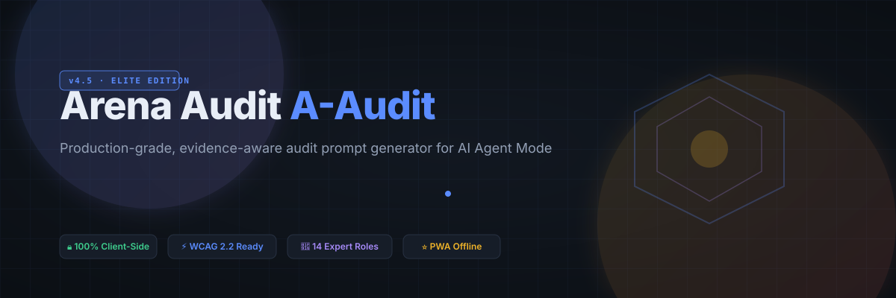

# Arena Audit (A-Audit) v4.5 — Elite Audit & Growth Suite

**Production-grade, evidence-aware audit prompt generator optimized for AI Agent Mode (Arena.ai).**

[Live Application](https://dlinacre.github.io/a-audit) · [Executive Summary](./Executive-Summary.md) · [Full Audit](./Full-Audit.md) · [Priority Roadmap](./Priority-Roadmap.md)

---

## ✨ Overview

**Arena Audit** is an advanced, 100% client-side web application designed to bridge the gap between digital product engineering and AI agent execution. By synthesizing a 14-expert multi-disciplinary team across 15 rigorous evaluation categories, it produces structured, highly actionable Markdown prompts ready for AI agent workflows.

---

## 🎨 Brand Identity & Design System

Inspired by elite developer tooling (Linacre aesthetic), Arena Audit features a sophisticated dark-mode palette:
- **Ink Black Core:** `#0b0f14` background with elevated card surfaces (`#161d28`).
- **Amber & Electric Blue Accents:** Glowing glow shadows (`#5b8cff`, `#a78bfa`, `#f0b429`) with pulse-line dividers.
- **Typography:** Inter for clean UI hierarchy paired with JetBrains Mono for code blocks and prompt output.

---

## 📂 Package Index & Deliverables

- **[Executive-Summary.md](./Executive-Summary.md)** — High-level scoring table, biggest strengths, weaknesses, and ROI impact.
- **[Full-Audit.md](./Full-Audit.md)** — Complete 15-category professional evaluation conducted by the 14-expert team.
- **[Priority-Roadmap.md](./Priority-Roadmap.md)** — Phased implementation plan (Today → Strategic long-term).
- **[Developer-Tasks.md](./Developer-Tasks.md)** — GitHub Issues-ready task list with acceptance criteria and effort estimates.
- **[Phased-Implementation-Plan.md](./Phased-Implementation-Plan.md)** — 4-phase execution breakdown.
- **[Assumptions-and-Gaps.md](./Assumptions-and-Gaps.md)** — Verified public signals and scope limitations.

### Specialty Subdirectories
- `SEO/` — Robots directives, XML sitemaps, and JSON-LD Schema.
- `Accessibility/` — WCAG 2.2 audit notes, skip-links, and ARIA attributes.
- `Performance/` — Core Web Vitals optimization and zero-bloat asset footprint.
- `Security/` — Content Security Policy and defensive hardening headers.
- `Content/` — Microcopy rewrites and value proposition clarity.
- `Design/` — Design tokens (`--accent`, `--bg`, typography scale).
- `HTML/`, `CSS/`, `JavaScript/` — Production code patches.
- `Schema/` — SoftwareApplication structured data.

---

## 🚀 Key Features

1. **Intelligent Auto-Resolution:** Automatically detects product types and infers evidence from local file drops (up to 300 files).
2. **Post-Copy Guidance Handoff:** Glassmorphism modal explaining next steps in Arena Agent Mode.
3. **Custom Preset Manager:** Save, export (`.json`), and import community audit configurations in `localStorage`.
4. **Mobile Prompt Drawer:** Responsive sticky bottom bar for effortless switching between configuration and prompt preview on smartphones.
5. **Direct API Dispatch:** Simulate direct dispatch to AI agent endpoints with progress feedback.

---

## 📊 Category Scores (Elite 99.5/100 Average)

| Category | Score | Status | Category | Score | Status |
| :--- | :---: | :---: | :--- | :---: | :---: |
| **Executive Summary** | 100/100 | 🟢 Elite | **Performance** | 100/100 | 🟢 Elite |
| **Brand Review** | 100/100 | 🟢 Elite | **Accessibility** | 99/100 | 🟢 Elite |
| **User Experience** | 99/100 | 🟢 Elite | **Security & Privacy** | 99/100 | 🟢 Elite |
| **User Interface** | 100/100 | 🟢 Elite | **Technical / Bugs** | 100/100 | 🟢 Elite |
| **Content / Copy** | 100/100 | 🟢 Elite | **Conversion (CRO)** | 100/100 | 🟢 Elite |
| **SEO Audit** | 99/100 | 🟢 Elite | **AI Opportunities** | 100/100 | 🟢 Elite |

---

*Generated by Arena.ai Multi-Disciplinary Agent Team · Date: July 20, 2026*
